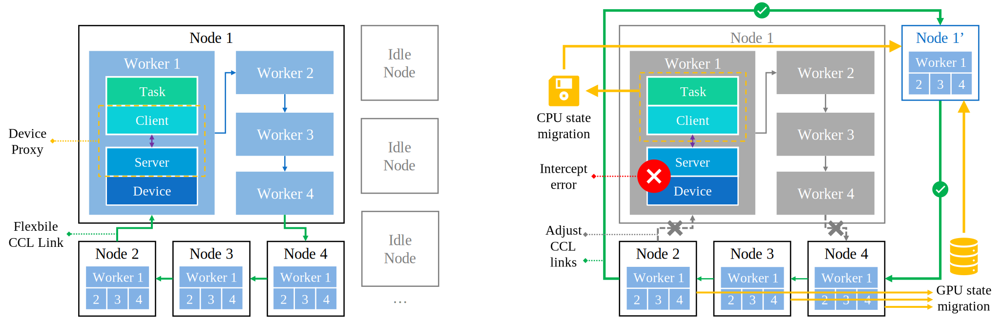

# Mnemosyne

A **lightweight**, **fast**, and **transparent** error recovery framework for LLM training in a just-in-time manner.



*Figure: The workflow of Mnemosyne. The left part shows the steady-state work, and the right part shows the recovery process.*

## Advantages

- ⚡️ **Transparent and periodic-checkpointing-free recovery** inherited from Microsoft's just-in-time checkpointing.
- ✂️ **Tailed mechanisms for error recovery** to minimize daily overhead.
- 🛠️ Support for **runtime adjustment of collective communication groups**.

## Note

The prototype of [device proxy](https://networked-system-and-security-group.github.io/Mnemosyne/device-proxy/) can be found in the `device-proxy` directory, and the prototype of [flexible CCL](https://networked-system-and-security-group.github.io/Mnemosyne/flexible-ccl/) can be found in the `flexible-ccl` directory.

## Cite

Your citations are greatly appreciated. 🥰

- ACM Reference
    > Jinyi Xia, Menghao Zhang, Jiaxun Huang, Yuezheng Liu, Xiaohe Hu, Xudong Liu, and Chunming Hu. 2025. Mnemosyne: Lightweight and Fast Error Recovery for LLM Training in a Just-In-Time Manner. In Proceedings of the 9th Asia-Pacific Workshop on Networking (APNET '25). Association for Computing Machinery, New York, NY, USA, 157–163. https://doi.org/10.1145/3735358.3735372
- Bibtex
    ```bibtex
    @inproceedings{10.1145/3735358.3735372,
    author    = {Xia, Jinyi and Zhang, Menghao and Huang, Jiaxun and Liu, Yuezheng and Hu, Xiaohe and Liu, Xudong and Hu, Chunming},
    title     = {Mnemosyne: Lightweight and Fast Error Recovery for LLM Training in a Just-In-Time Manner},
    year      = {2025},
    isbn      = {9798400714016},
    publisher = {Association for Computing Machinery},
    address   = {New York, NY, USA},
    doi       = {10.1145/3735358.3735372},
    booktitle = {Proceedings of the 9th Asia-Pacific Workshop on Networking},
    pages     = {157-163},
    numpages  = {7},
    series    = {APNET '25}
    }
    ```
