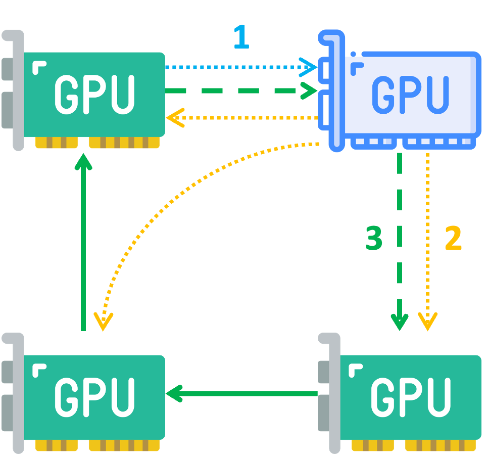

# Flexible CCL

<p align="center">
    
</p>
<p align="center">Figure: Overview of Flexible CCL.</p>

Flexible CCL is a componnet of Mnemosyne.
It is developed based on NCCL 2.23.4-1.

## Build

To build the library:

```shell
make -j src.build
```

To build test files:

```shell
make -f dev.mk -j build/test/addition
make -f dev.mk -j build/test/removal
```